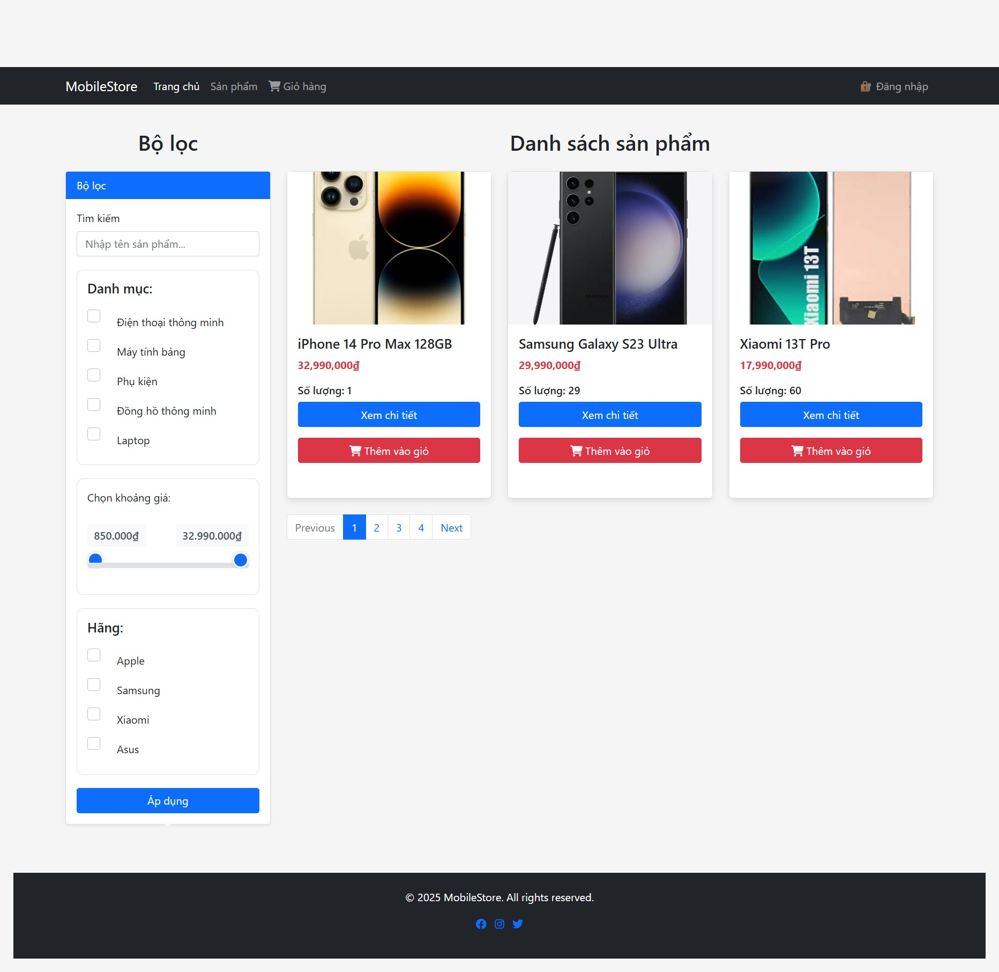
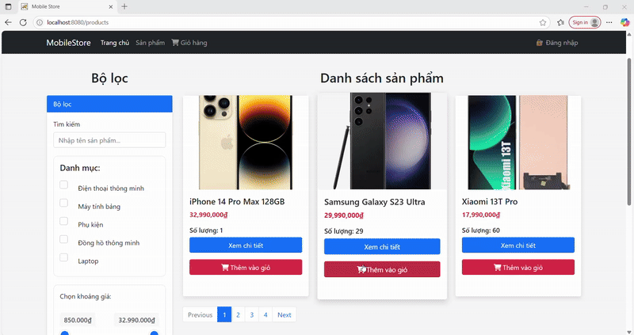
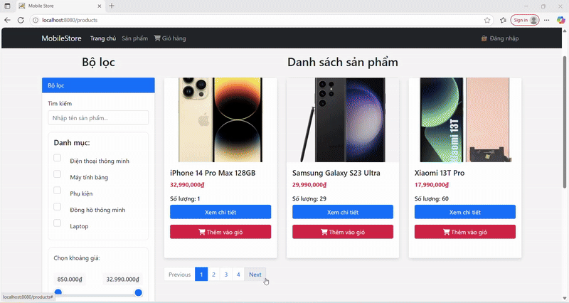

# 📱 Mobile Store Web Application

A feature-rich web application for a mobile phone store, built using **Spring MVC**, **Spring Security**, **Thymeleaf**, and **Hibernate/JPA**, with full CRUD functionality, product filtering, file upload support, session-based shopping cart, and AJAX-based UI interactions.

---

## 🛠 Technologies Used

* **Java 8+**
* **Spring MVC**
* **Spring Security**
* **Spring Data JPA**
* **Hibernate ORM**
* **Thymeleaf**
* **Bootstrap 5**
* **MySQL**
* **jQuery & AJAX**

---

## 🌟 Key Features

### ✅ Product Management

* Add, edit, delete, and view product details
* Product image upload using `multipart/form-data`
* Price formatting with localized currency display
* Enum fields replaced with lookup tables for flexibility

### 🔎 Product Filtering (AJAX)

* Search by name (case-insensitive)
* Filter by category, brand, and price range
* Dynamic pagination with real-time updates

### 🛒 Shopping Cart

* Add to cart using AJAX
* View cart and quantities in session
* Update or remove items
* Validate product availability before adding

### 🔐 User Features

* CSRF protection (custom-configured for file uploads)
* Form validation (both server-side and client-side)
* Localized labels and currency format (VN/EN ready)

---

## 📁 Project Structure

```
src/
└── main/
    ├── java/com/codegym/mobilestore/
    │   ├── component/           # Custom beans, utilities
    │   ├── configuration/       # Spring configuration (WebConfig, SecurityConfig, etc.)
    │   ├── controller/          # Web controllers (handle requests)
    │   ├── dto/                 # Data Transfer Objects
    │   ├── model/               # JPA entities
    │   ├── repository/          # Spring Data JPA interfaces
    │   ├── service/             # Business logic layer
    │   ├── specification/       # Custom search filters and queries
    │   └── HelloServlet.java    # Example Servlet (optional/test)
    │
    ├── resources/
    │   ├── static/              # Static files (CSS, JS, images)
    │   └── secret.properties    # Sensitive configurations (excluded from Git)
    │
    └── webapp/
        ├── index.jsp
        └── WEB-INF/
            └── views/
                ├── cart/        # Cart-related views
                ├── checkout/    # Checkout page
                ├── fragments/   # Common layout fragments
                └── product/     # Product list, details, add/edit pages

```

---

## ⚙️ Configuration Notes

* Configure file upload location using `application.properties`
* Add `CommonsMultipartResolver` bean for file uploads
* CSRF token handling is customized for AJAX and file upload scenarios

---

## 📷 Screenshots

> * Product listing with filters

> * Add product form

> * Cart session demo
> * AJAX pagination in action
---

## 🚀 How to Run

1. Clone the repository
2. Set up the MySQL database and import schema (with sql file)
3. Configure `application.properties` with DB credentials
4. Run the application using your preferred IDE or Maven
5. Access the app at `http://localhost:8080/mobilestore`

---

## 📌 TODOs / Next Steps

* User registration
* Admin dashboard
* Internationalization (i18n)
* PDF/Excel export
* Voucher/discount integration
